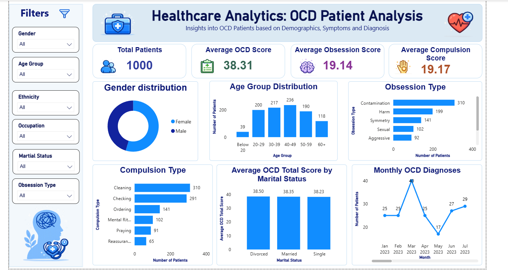

# Healthcare Analytics – OCD Patient Analysis
Healthcare Analytics project using SQL and Power BI to analyze OCD patient data.

## 📊 Project Overview

This project analyzes OCD patient data to identify patterns in patient demographics, OCD symptoms, diagnosis trends, and clinical scores.

The project uses PostgreSQL/SQL for data analysis and Power BI for interactive data visualization.

## 🛠️ Tools & Technologies

- PostgreSQL
- SQL
- Power BI
- DAX
- Excel / CSV
- Data Visualization

## 📁 Project Structure

- `SQL/` – SQL queries and analysis
- `PowerBI/` – Power BI dashboard and dashboard screenshot
- `Dataset/` – OCD healthcare dataset

## 📌 Key Analysis

The project analyzes:

- Gender-wise patient distribution
- Age group distribution
- Obsession types
- Compulsion types
- Average OCD scores
- Average obsession and compulsion scores
- Marital-status-wise OCD scores
- Monthly OCD diagnosis trends

## 📊 Power BI Dashboard

The Power BI dashboard provides interactive filters for:

- Gender
- Age Group
- Ethnicity
- Occupation
- Marital Status
- Obsession Type

## 📈 Key KPIs

- Total Patients: 1,000
- Average OCD Score: 38.31
- Average Obsession Score: 19.14
- Average Compulsion Score: 19.17

## 📊 Power BI Dashboard

## 🎯 Objective

The objective of this project is to demonstrate practical skills in SQL-based healthcare data analysis and Power BI dashboard development.

